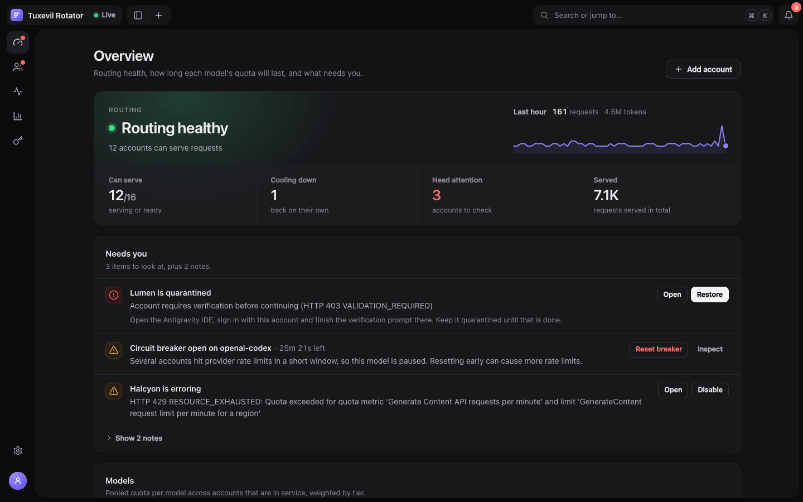
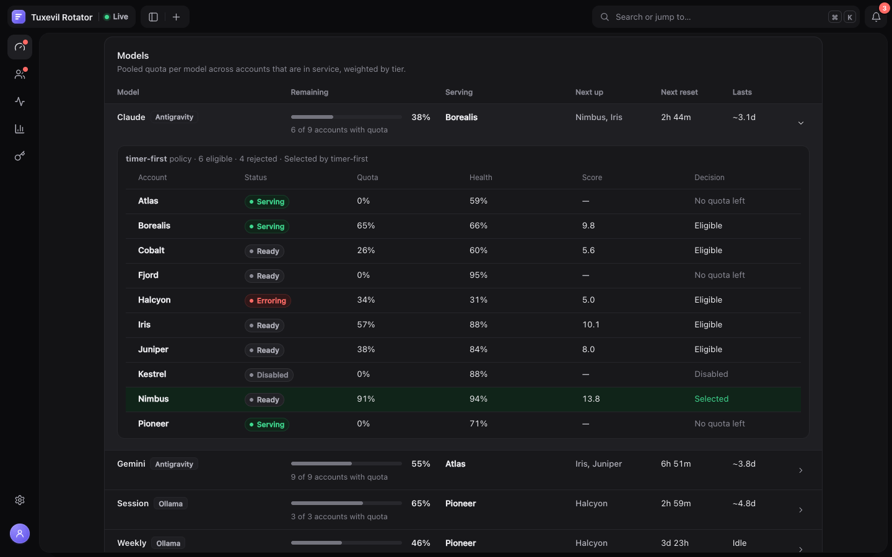
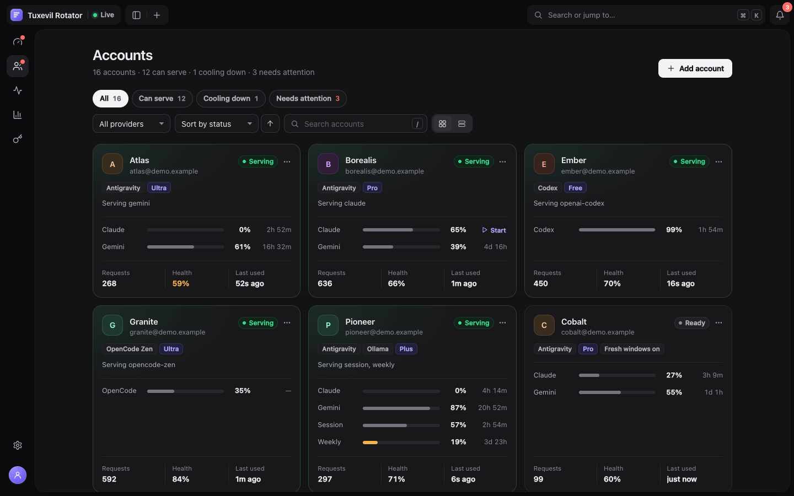
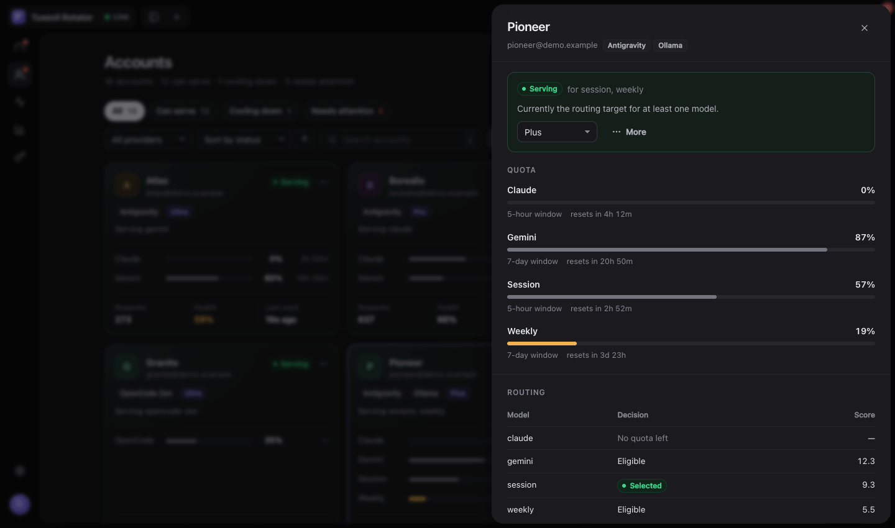
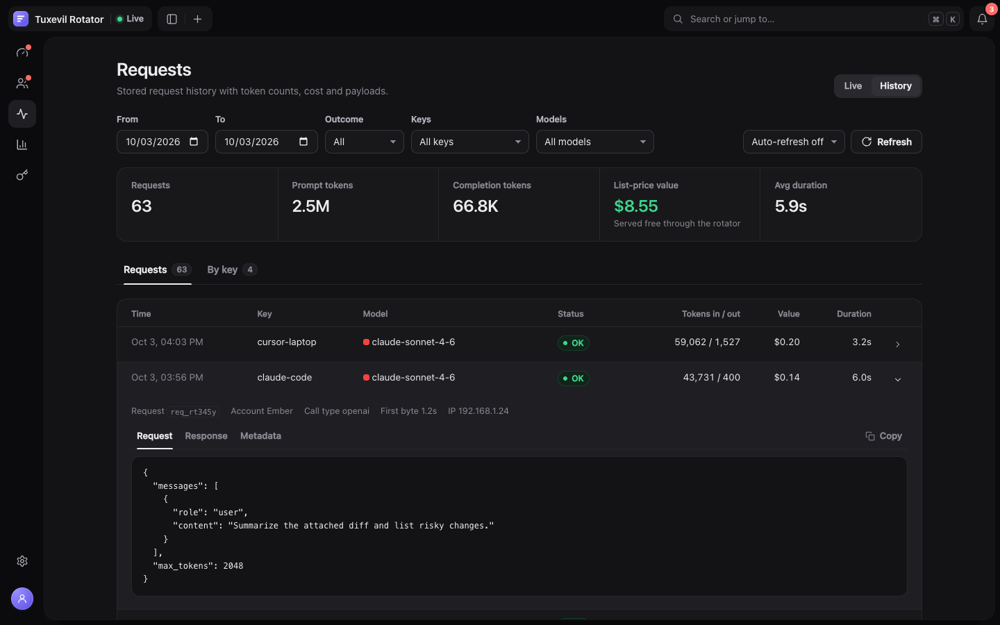
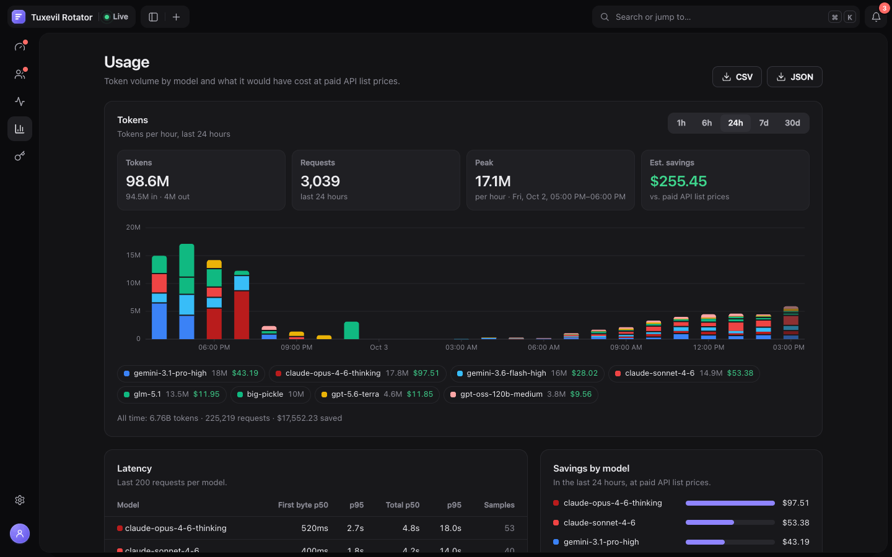
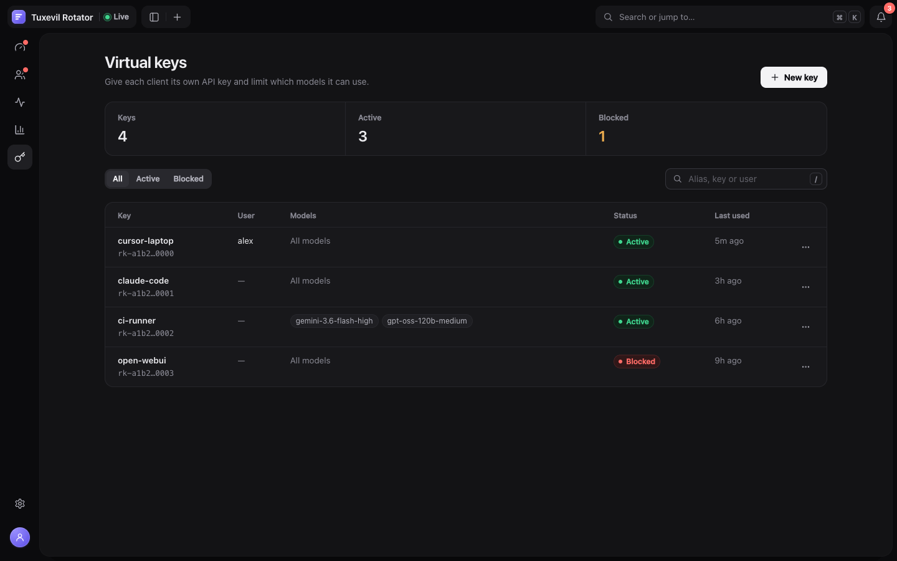

# Dashboard

The rotator serves a web dashboard at `/dashboard` on the proxy port (by default `http://localhost:51200/dashboard`). It is a single-page app bundled in memory when the rotator starts, so there is no separate build step, and it updates live over a server-sent event stream.

## Signing in

The sign-in screen asks for the admin token: `TUXEVIL_ROTATOR_ADMIN_TOKEN`, or the token generated on first run and saved to `.admin-token` (see [Configuration](configuration.md#environment-variables)). A link of the form `/dashboard?token=<token>` signs in directly.

Either way the token is exchanged for a session cookie that lasts 30 days, and the token is removed from the address bar; the dashboard never stores the token itself. Rotating the admin token signs every browser out. **Sign out** (in the profile menu, Settings → About, or <kbd>⌘K</kbd>) revokes that session on the server until the rotator restarts.

Behind a reverse proxy, forward the original `Host` header (see [Deployment](deployment.md#reverse-proxy-with-nginx)); otherwise actions that change state are refused with `403`. The [API reference](api-reference.md#authentication) describes the cookie in detail.

## Getting around

- **Top bar**: the live connection status, a sidebar toggle, **+** to add an account, the search box, and a bell that lists everything that needs you (the same list as the Overview's **Needs you** panel).
- **Sidebar**: Overview, Accounts, Requests, Usage and Virtual keys, with Settings at the bottom. The toggle expands it to show labels. The avatar at the foot opens the profile menu: theme, privacy mask, command palette and sign out.
- **Command palette**: <kbd>⌘K</kbd> (<kbd>Ctrl</kbd>+<kbd>K</kbd>) jumps to any page or account (search by name, email, provider or status) and runs quick actions: add an account, switch theme, toggle the privacy mask, expand the sidebar, export usage as CSV, sign out.
- <kbd>/</kbd> focuses the current page's search box, or opens the palette on pages without one.
- **Links**: every page, filter, sort order and open account drawer is part of the URL, so a link opens exactly the same view. The URL scheme is listed in the [API reference](api-reference.md#dashboard-routes).
- **Phones**: the sidebar becomes a slide-over sheet and the account drawer a bottom sheet.
- **Updates**: when a newer release is available a banner links to the changelog and offers **Update now** (see [Updating](deployment.md#updating)).

## Status vocabulary

Every page uses the same labels. The value in parentheses is what `/api/status` reports.

| Account status | Meaning |
|---|---|
| **Serving** (`active`) | The current routing target for at least one model |
| **Ready** (`ready`) | Healthy and available, waiting for its turn |
| **Cooling down** (`cooldown`) | Waiting out a provider rate-limit window; comes back on its own |
| **Out of quota** (`exhausted`) | Stopped by a [daily safety budget](how-it-works.md#daily-safety-budgets) until the next UTC day |
| **Erroring** (`error`) | Recent requests failed; review the error before it escalates to Disabled |
| **Disabled** (`disabled`) | Out of service after repeated errors or by an operator; re-enable once fixed |
| **Quarantined** (`flagged`) | Flagged by the provider or quarantined by an operator; excluded from routing until restored |

| Routing state | Meaning |
|---|---|
| **Routing healthy** (`healthy`) | Requests are being served |
| **All accounts busy** (`busy`) | Every routable account is at its concurrency limit |
| **Waiting for cooldowns** (`cooldown_wait`) | No account is free; routing resumes when a cooldown ends |
| **Routing paused** (`paused`) | A protective pause is holding all traffic |
| **Routing stopped** (`stopped`) | No account can serve requests |

Quota bars stay neutral and turn amber when a pool drops below 20% and red when it is empty. A quota window that has not started is shown as **Idle — no window running**, with a **Start** button that opens it (see [Fresh Windows](how-it-works.md#fresh-windows)).

## Overview

The Overview answers whether routing works and for how long:

- **Routing**: the routing state, how many accounts can serve, and requests and tokens over the last hour. Below it, counts of accounts that can serve (Serving or Ready), are cooling down and need attention, and the total requests served.
- **Needs you**: quarantined, erroring and disabled accounts, open circuit breakers, models no account can serve, protective pauses and security warnings, each with the action that fixes it (**Restore**, **Re-enable**, **Disable**, **Reset breaker**, **Inspect**). Lower-priority notes are collapsed under **Show notes**.
- **Models**: one row per quota pool (Claude, Gemini, Codex, Ollama session and weekly, OpenCode) with the pooled quota left across accounts in service (weighted by tier), the account serving it (the one whose status reads **Serving**), the next accounts in line with the policy's pick for the next rotation first, the next reset, and how long the quota lasts at the current rate. A pool is marked **Running low**, **Empty** or **Blocked** (breaker open, or no account with quota).
- **Recent problems**: failed requests and error events since the rotator started.
- **Controls**: the **Allow fresh windows** and **Auto-warmup** switches, applied to every account immediately.

Expanding a model row shows the routing decision for that pool: the active policy and, for every candidate account, its status, quota, health, score and why it was selected, eligible or rejected.

## Accounts

Accounts are shown as cards or as a compact sortable list; the toggle next to the search box switches between them and the choice is remembered in the browser.

- **Filters**: All, Can serve, Cooling down and Needs attention, plus a provider filter, a sort order (account, status, quota, health, requests, last used) and a search box. They are kept in the URL (`?status=`, `?provider=`, `?sort=`, `?dir=`, `?q=`).
- **Cards** show the status, providers and tier, which models the account is serving, the quota per pool with its reset countdown (or **Start** for an idle window), requests, health and last use. Erroring, disabled and quarantined accounts also show the last error, and the last two a **Re-enable** or **Restore** button.
- **Actions**: the **⋯** menu on each card or row has Open details, Re-enable, Restore to rotation, Disable, Quarantine, Always allow fresh windows (or Follow global fresh-window policy) and Remove account.
- **Add account** opens the provider sign-in page in a new tab: `/login` when hosted OAuth is configured, otherwise `/login-cli`, which walks through the CLI flow. See [Adding Accounts](adding-accounts.md).

### Account drawer

Clicking an account opens its drawer at `/dashboard/accounts/<email>`.

- **Status** with an explanation, the tier selector (used by `tier-first` and `hybrid` routing), and **More** for every action in the menu above.
- **Last error** with a suggested fix, plus per-model and per-provider cooldowns and rejected provider credentials (for example a Codex credential that needs a new login).
- **Quota**: each pool's remaining quota, its window (5-hour, 7-day, monthly pool, or idle) and when it resets.
- **Routing**: the decision and score for each model, and the health-score breakdown (quota minus the error, cooldown and availability penalties; see [Health Scoring](how-it-works.md#health-scoring)).
- **Limits and activity**: total requests and requests since the last rotation, last use, daily account and project budgets, requests in flight against the concurrency cap, the fresh-window setting and the access token state.

## Requests

**Live** streams the last 200 requests held in memory, interleaved with rotator and proxy events (rotations, upstream errors). Filter by all, errors or successful, hide rotator events, search by model, account or status, or **Pause** the stream. It works without PostgreSQL.

**History** needs PostgreSQL and shows the stored request log:

- Filter by date range, outcome, virtual keys and models; filters are kept in the URL. Auto-refresh can be set to every 10 seconds, 30 seconds or minute.
- Totals for the filtered range: requests, prompt and completion tokens, list-price value and average duration.
- **Requests** lists each request (25 per page); click a row to see the request body, the response and the metadata, each with a copy button. **By key** totals the same filters per virtual key.

What is recorded, and the matching REST endpoints, are described in [Virtual Keys & Spend Logging](virtual-keys.md#spend-logging).

## Usage

- **Tokens**: token volume by model for the last hour (per minute), 6 hours (per 5 minutes), 24 hours (per hour), 7 days or 30 days (per day). The headline figures describe the selected range: tokens in and out, requests, the peak bar and the estimated savings at paid API list prices. Hover a bar for its per-model breakdown; click a legend entry to hide or highlight a model. All-time totals are shown below the chart.
- **CSV** and **JSON** download the full token usage history.
- **Latency**: time to first byte and total duration (p50 and p95) per model, over the last 200 requests of each model.
- **Savings by model**: the selected range priced at each model's list price.
- **Activity**: requests per hour over the last 60 days, in your local time.

## Virtual keys

Virtual keys need PostgreSQL. The page lists every key with its owner, allowed models, status and last use, and can be filtered by status or searched by alias, key or user.

**New key** asks for an alias, an optional user and the allowed models (grouped by provider; none selected allows every model). The raw key is shown once, right after it is created. Each key's **⋯** menu has Edit models, Block or Unblock, and Delete key. See [Virtual Keys](virtual-keys.md) for scoping rules and the CLI.

## Settings

- **Routing**: the **Allow fresh windows** and **Auto-warmup** switches, and **Reset all breakers** while circuit breakers are open.
- **Policy**: the routing policy and its main limits (requests per rotation, rotate on quota drop, concurrent requests per account, quota poll interval). Everything else is edited in the configuration file. The policies are explained in [How It Works](how-it-works.md#routing-policies).
- **Accounts**: **Add account**.
- **Benchmark**: sends one small request through each active account and reports latency and failures. Results are not saved.
- **Configuration**: export, import or edit the raw configuration file (`accounts.json`). It contains account credentials, so keep exports private. Fields are described in [Configuration](configuration.md).
- **Appearance and privacy**: theme (follows the system unless you pick light or dark) and the privacy mask.
- **About**: version, uptime, listening address, whether an admin token is required, where request history is stored, project links and **Sign out**.

## Privacy mask

The privacy mask replaces account names, emails, keys and IP addresses with placeholders such as `Account 1`, for screenshots and screen sharing. Turn it on from the profile menu, Settings, or <kbd>⌘K</kbd>, or add `?mask=1` to any dashboard link. The setting is remembered in the browser.

## Working on the dashboard

The source is in `src/web` (Preact and TypeScript). `npm run dashboard:dev` runs the real dashboard routes against a simulated rotator with sample accounts and traffic; see [Contributing](../CONTRIBUTING.md#working-on-the-dashboard).
